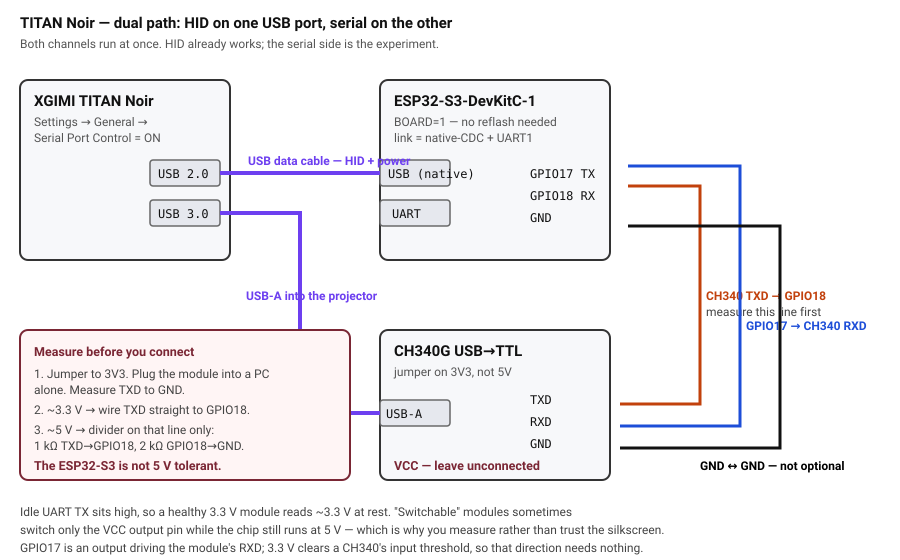

# titan-bridge

Discrete control for an **XGIMI TITAN Noir** projector — real power on and off,
direct input select, picture presets, volume, focus, and a macro engine that
drives the on-screen menu for everything the published command set omits.

Exposed three ways at once: a **web app** you can add to a phone's home screen,
a **REST API** for Home Assistant, and **Roku ECP emulation** so a SofaBaton
hub discovers it as a TV and drives it with a native remote layout.

> ### Alpha 0.8.4
>
> Working, daily-usable, and verified on **one** unit — an XGIMI TITAN Noir Max.
> Nothing here has been tried on another projector or another firmware build.
>
> Menu-walking macros are positional and tied to a specific projector firmware;
> everything else is protocol-level and should travel further.
>
> [`logs/TEST-LOG.md`](logs/TEST-LOG.md) records what was **measured** rather
> than assumed, including several things that turned out to contradict XGIMI's
> own documentation.

---

## What works

| Capability | Status | Notes |
|---|---|---|
| Menu navigation | ✅ | arrows, OK, Back, Menu — on **either** channel |
| Discrete power **on** | ✅ | serial `wake`, or HID `0x66` |
| Power **off** | ✅ | serial power key + confirm, or HID `0x66` |
| Direct input select | ✅ | HDMI1 / HDMI2 / **HDMI3** / USB — serial |
| Picture modes | ⚠️ | Only **Performance** and **Filmmaker** take effect. See below. |
| Brightness, blank, high-refresh | ✅ | serial |
| Volume, mute, autofocus, manual focus | ✅ | |
| Macro recorder + step editor | ✅ | records real key timing; saves an editable script |
| Home Assistant | ✅ | REST, no MQTT, no custom component, no HACS |
| SofaBaton X2 | ✅ | Roku ECP; saved macros appear as launchable apps |
| Infrared receiver | ✅ | optional TSOP38238, so a dead router doesn't cost you the remote |
| **Reading power state** | ❌ | nothing on this projector reports it — see below |

### The one real limitation

**The projector never reports whether it is on.** Its serial daemon answers the
temperature probe *identically in standby*, and its USB bus never suspends — so
neither channel offers a liveness signal. The bridge therefore **tracks what it
last did** and labels the result `(assumed)`.

That is accurate until someone uses the physical remote, which nothing can
observe. One tap in **Settings → Power state** resyncs it without sending
anything to the projector.

### Picture modes are mostly decorative

Of the seven modes in XGIMI's published table, **two work**: Performance
(`0x05`) and Filmmaker (`0x1B`). Vivid, Movie, IMAX, TV and Sport are accepted,
acknowledged, and ignored — as are all 25 undocumented parameters in the range.

The on-screen menu offers a *different* set again — Standard, Movie, Sports,
ISF Day, ISF Night — sharing one name with the serial table. Performance and
Filmmaker do not appear in it at all, yet both work over serial. The two sets
overlap rather than match, and there is no serial parameter for Standard.

All seven are still exposed, because another TITAN on another firmware build
may well accept more of them. On this unit, five of them do nothing.

---

## Known-good hardware

Both of these are the exact parts this was built and verified against.

| Part | Why this one |
|---|---|
| **[ESP32-S3-DevKitC-1 (N16R8)](https://a.co/d/0eFIGSre)** | Two USB-C ports. The native port presents USB HID to the projector while the UART port keeps a console and flashing — a single-port board forces you to unplug the projector on every reflash. |
| **[DSD TECH SH-U09G — FTDI FT232RL USB-to-TTL](https://a.co/d/05u0XP1Y)** | The **only** adapter class this projector binds. 3.3 V TTL, so it wires straight to the ESP32 with no level shifting. |

### Adapters that do NOT work

This cost a day to establish, so it is worth stating plainly:

| Chip | Driver | Binds? |
|---|---|---|
| **FT232RL** | `ftdi_sio` | ✅ **yes** |
| CP2102 | `cp210x` | ❌ never |
| CH340G | `ch341` | ❌ never |

In every failing case the wiring was proven first on a bench — laptop standing
in for the projector, frames out and replies in — so the failures were
unambiguously the projector's kernel driver support, not the rig. If you buy a
"USB to TTL" cable, **check the chip**.

### Optional

- **TSOP38238** IR receiver on GPIO15, for a physical remote fallback
- A **5 V supply**, if you later drop the HID channel (see *Simplifying* below)

---

## Wiring

Two independent channels. You can run either alone, or both at once — which is
what the diagram shows, and what is recommended while you are still finding out
what your unit does.



### Channel A — USB HID (no extra parts)

| From | To |
|---|---|
| ESP32-S3 **native USB-C** | projector **USB 3.0** — carries HID *and* powers the board |
| ESP32-S3 **UART USB-C** | your laptop, for flashing and console (optional once Wi-Fi is up) |

### Channel B — serial, via the FTDI cable

| Cable wire | Label | ESP32-S3 |
|---|---|---|
| **blue** | `TXD` | **GPIO18** |
| **white** | `RXD` | **GPIO17** |
| **black** | `GND` | **GND** (any — they are one net) |
| yellow | `CTS` | *not connected* |
| green | `RTS` | *not connected* |
| red | `VCC` | *not connected* — it is 5 V |

The cable's **USB-A** goes into the projector's **USB 2.0** port.

**TX and RX cross**: the adapter's transmit goes to the ESP32's receive.

> **Check the logic level before wiring.** The SH-U09G is 3.3 V TTL, which is
> safe. If you use a different cable, measure **TXD to GND** — an idle TX line
> sits high, so you want ~3.3 V. GPIO18 is **not 5 V tolerant**. If it reads
> 5 V, fit a divider on that line only: 1 kΩ from TXD to GPIO18, 2 kΩ from
> GPIO18 to GND. Do **not** fit that divider speculatively — it drops a genuine
> 3.3 V signal to ~2.2 V, below the ESP32-S3's logic-high threshold.

### On the projector

**Settings → General → Serial Port Control = ON.** Leave `ID Group` at `A`,
`ID Number` at `0`, and both Response toggles on — that is the most permissive
configuration, and the bridge implements no addressing to match against.

---

## Install

### 1. Toolchain

```bash
# arduino-cli, macOS arm64 — adjust the URL for your platform
curl -fsSL -o acli.tgz https://downloads.arduino.cc/arduino-cli/arduino-cli_latest_macOS_ARM64.tar.gz
tar xzf acli.tgz arduino-cli && mkdir -p ~/.local/bin && mv arduino-cli ~/.local/bin/

URL=https://espressif.github.io/arduino-esp32/package_esp32_index.json
~/.local/bin/arduino-cli core update-index --additional-urls "$URL"
~/.local/bin/arduino-cli core install esp32:esp32 --additional-urls "$URL"
```

Verified against **esp32 core 3.3.11**. No external libraries — everything used
ships with arduino-esp32.

### 2. Build and flash

```bash
cd firmware
~/.local/bin/arduino-cli compile \
  --fqbn "esp32:esp32:esp32s3:USBMode=default,CDCOnBoot=default,FlashSize=16M,PartitionScheme=min_spiffs" \
  --build-property "compiler.cpp.extra_flags=-DBOARD=1" \
  --upload -p /dev/cu.usbmodemXXXX titan_bridge_p2
```

**`USBMode=default` is not optional.** It selects USB-OTG/TinyUSB; under the
`hwcdc` default the HID interface never enumerates and the HID channel simply
does not exist.

Find the port with `arduino-cli board list`. On this board **both** USB ports
enumerate as `usbmodem*` — the UART one is a separate bridge chip ("USB Single
Serial" / CH343), the other is Espressif silicon. Flash through the **UART**
one.

### 3. Wi-Fi

No credentials are compiled in. On first boot the bridge raises an access point
**`TitanBridge-XXXX`** (password `titanbridge`). Join it, open
<http://192.168.4.1/>, enter your network.

Or, over the UART console at 115200:

```
wifi <ssid> <password>
```

It then lives at **http://titan-bridge.local/** and accepts OTA updates:

```bash
python3 ~/Library/Arduino15/packages/esp32/hardware/esp32/3.3.11/tools/espota.py \
  -i <bridge-ip> -p 3232 -f build/titan_bridge_p2.ino.bin -r
```

> **Pin a DHCP reservation.** SofaBaton stores the device by IP, and mDNS adds a
> resolution step that occasionally times out.

### 4. Add to your phone

Open the bridge in Safari → Share → **Add to Home Screen**. It launches
chromeless with its own icon.

### Other boards

`BOARD=` selects a profile in `config.h`:

| Board | `BOARD` | Native USB | Default channel |
|---|---|---|---|
| ESP32-S3-DevKitC-1 | `1` | yes | HID + serial |
| Heltec WiFi LoRa 32 V3/V4 | `2` | not on the connector | onboard bridge chip |
| Classic ESP32 (WROOM-32) | `3` | none | onboard bridge chip |

A board with no native USB has HID masked out rather than failing to build.
See [`docs/09-onboard-bridge-path.md`](docs/09-onboard-bridge-path.md) for
running with **no adapter at all**, using a dev board's own USB-serial chip.

---

## Using it

### The app

Three tabs. **Titan Bridge** — power, D-pad, volume and focus rockers, and a
segmented strip of every direct action. **Macros** — recorder, grouped list,
and a chip-based step editor. **Settings** — control channel, power behaviour,
the ECP routing table, live status and log.

### Control channel

Navigation can travel over **serial** or **USB HID**, switchable in Settings and
remembered across reboots. Serial is only selectable once a valid frame has
actually arrived, because selecting it with no adapter attached would leave
every key silently doing nothing.

Macro steps `k:` follow the active channel; `h:` and `s:` force one.

### Macros

```
anchor; k:down*3; d400; k:ok; k:back*3
```

| Token | Meaning |
|---|---|
| `k:<key>` | key on the **active** channel |
| `h:<key>` / `s:<cmd>` | force HID / force serial |
| `m:<name>` | run another macro |
| `r:<hex>` | raw frame |
| `p:on` `p:off` | power |
| `d<ms>` | wait |
| `anchor` | back ×3 then settings — forces a known menu root |
| `tok*<n>` | repeat |

**Record instead of counting.** Press Record, drive the projector, press Stop.
The recorder captures each key *and the real gap between presses*, so the
delays are the ones the OSD actually kept up with rather than a guessed
constant.

### Home Assistant

Copy [`homeassistant/titan_noir.yaml`](homeassistant/titan_noir.yaml) into
`config/packages/`, set the host, restart. Gives you a power switch, input and
picture-mode selects, temperature and diagnostic sensors, and buttons. The
Lovelace card is in the same directory.

### SofaBaton X2

Hub app → add device → Wi-Fi → **Roku** → scan. It appears as **Titan Bridge**.

The app discovers by *listening for announcements*, not by its own search
reaching the device — so if it cannot find the bridge, hit `GET /api/announce`
and rescan. Details and the full key map in
[`docs/08-integration.md`](docs/08-integration.md).

---

## Simplifying later

Once you are confident serial covers everything you use, the HID channel — and
with it one projector USB port — can be dropped:

- FTDI cable → projector USB, ESP32 → **its own 5 V supply**
- The ESP32's native USB port comes free

The catch: the board is currently powered *by* the projector's USB through that
very port, so removing it means providing power. Keeping both costs nothing but
a USB port, and HID carried the entire project for two days while serial looked
impossible.

---

## Repo layout

```
firmware/titan_bridge_p2/   production firmware — web app, macro engine,
                            power state machine, Roku ECP, IR, OTA
firmware/titan_bridge_p1/   Day 1 diagnostic sketch with a serial console
docs/                       the runbook, in the order you need it
hardware/                   wiring diagrams
homeassistant/              drop-in package and Lovelace card
tools/    titan_serial.py     drive the projector from a laptop, no ESP32
          fake_projector.py   pretend to BE the projector, so the bridge can be
                              tested at a desk with nothing else plugged in
          ecp_probe.py        see the bridge the way a hub sees it
logs/TEST-LOG.md            what was measured, including the surprises
plan/                       the original build plan and its reasoning
```

---

## Things that turned out not to be true

Recorded because each one cost real time, and because the documentation still
says otherwise.

- **XGIMI's command table omits HDMI3.** The third input is real and selectable
  as parameter `0x03`. The table appears to be copied from the two-input
  original TITAN.
- **The projector acknowledges every command** with `instruction | 0x80` and the
  parameter echoed — undocumented. It confirms *receipt only*: a sweep ACKed
  parameters that cannot possibly exist, including `0xFE`.
- **The temperature probe is not a power indicator.** It answers identically in
  standby, which is why power state is assumed rather than measured.
- **Commands are honoured in standby.** You can pre-select an input and then
  wake, and the projector comes up on it.
- **`0x07` parameter `0x06` opens a calibration test pattern** — a service
  screen with no button on the remote.
- **Only FTDI binds.** CP2102 and CH340 are never bound by this projector.
- **An ACK does not mean the command did anything.** Five *documented* picture
  modes acknowledge cleanly and change nothing. Receipt is all it proves — the
  converse of the previous point, and it cost a full probing session to notice.
- **The protocol is write-only apart from temperature.** Instruction `0x13`
  looked like a query family; parameters `01`–`20` were swept and every one
  ACKs while returning no data. Nothing reads back input, picture mode, volume
  or power.
- **Settings changed on the physical remote are invisible.** A five-mode walk
  through the picture menu produced no serial traffic whatsoever.

---

## Licence

None yet — ask.
